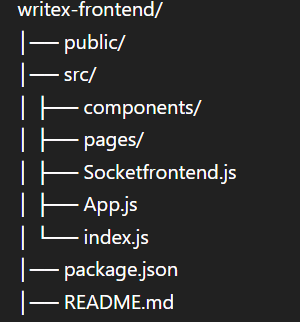

# ✍️ WriteX Frontend

🚀 **WriteX** is a real-time collaborative text editor frontend that allows multiple users to write, edit, and collaborate seamlessly from anywhere.

🔗 **Live Demo:**  
👉 https://writex-frontend-git-main-yoganand4k-2043s-projects.vercel.app/

---

## 📌 Features

- 📝 Real-time collaborative editing  
- 🌐 Multi-user support with live updates  
- ⚡ Fast and responsive UI  
- 🔗 Room-based editing system  
- 🎯 Clean and minimal interface  

---

## 🛠️ Tech Stack

- **Frontend:** React.js  
- **Styling:** CSS  
- **Real-time Communication:** Socket.IO  
- **Deployment:** Vercel  

---

## 📂 Project Structure




## ⚙️ Installation & Setup

Follow these steps to run the project locally:

### 1️⃣ Clone the repository
```bash
git clone https://github.com/Yoganand2004/writex-frontend.git
cd writex-frontend

2️⃣ Install dependencies
npm install
3️⃣ Start the development server
npm start
🔌 Backend Requirement

This frontend connects to a backend server using Socket.IO.

Make sure your backend is running at:

http://localhost:8003
🚀 Deployment

The project is deployed on Vercel.

To deploy your own version:

npm run build

Then deploy using:

vercel deploy
📸 Preview

👉 Try it live:
https://writex-frontend-git-main-yoganand4k-2043s-projects.vercel.app/

🤝 Contributing

Contributions are welcome!

Fork the repo
Create a new branch
Make your changes
Submit a pull request
📄 License

This project is open-source and available under the MIT License.

👨‍💻 Author

Yoga Nand Roy
📌 B.Tech CSE Student | Developer